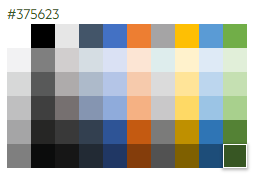

# Color Palette Overview

The <a href = "https://www.telerik.com/blazor-ui/colorpalette" target="_blank">Blazor Color Palette component</a> provides a list of color tiles for the user to pick a color from by clicking or tapping. You can choose a [predefined list of colors](), or [create your own](). Two-way binding and [events]() let you react to the user choice.

## Basics

To use a Telerik Color Palette for Blazor:

1. Add the `<TelerikColorPalette>` tag.
1. Bind its `Value` to the `string` you want to get out of it.
1. Choose a set of colors (the example below uses one of the predefined options).

>caption Basic color palette with two-way value binding and a predefined palette

````CSHTML
@MyColor
<br />

<TelerikColorPalette Palette="@PalettePresets.Austin" @bind-Value="@MyColor">
</TelerikColorPalette>

@code {
    public string MyColor { get; set; }
}
````

>caption The result from the code snippet above before you start writing




## Features

>caption The Masked Textbox provides the following features:

* `Class` - the CSS class that will be rendered on the wrapping element of the component.

* `Enabled` - whether the `input` is enabled.

* `Id` - renders as the `id` attribute on the `<input />` element, so you can attach a `<label for="">` to the input.

* `TabIndex` - maps to the `tabindex` attribute of the HTML element. You can use it to customize the order in which the inputs in your form focus with the `Tab` key.

* `Title` - maps to the `title` attribute of the HTML element. You can use it to add a [tooltip]().

* `Value` - get/set the value of the input, can be used for binding.

* `Width` - the width of the `input`. See the [Dimensions]() article.

* Validation - see the [Input Validation]() article.


## See Also

  * [Live Demo: Color Palette](https://demos.telerik.com/blazor-ui/colorpalette/overview)
  * [Live Demo: MaskedTextbox Validation](https://demos.telerik.com/blazor-ui/colorpalette/validation)
  * [Input Validation]()
  * [API Reference](https://docs.telerik.com/blazor-ui/api/Telerik.Blazor.Components.TelerikColorPalette)
